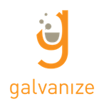

# Monthly Tech Night (Boulder) Meetup Repo

Monthly Tech Night (formally JS Night) is held on the first Monday of the month online (as of now). Check out our next Boulder Monthly Tech Night event on our [meetup](https://www.meetup.com/Women-Who-Code-Boulder-Denver/events/).

### Goals of the Monthly Boulder/Denver Tech Night meetup

- provide an opportunity for technical women to speak about technology
- learn about new technologies
- make new connections/ friends and grow your network
- create a community of women who code and women learning to code in Boulder/ Denver

### Our lightning talks archive

- [Past Presentation Topics](./lightning-talks/README.md)

### Speakers Wanted

We are always on the lookout for speakers for this meetup!
Have you learned something new or neat about javascript or related tech? Did you complete a JS related project and would like to practice talking about it for interviews? Solidify your new knowledge and presentation skills by doing a lightning talk for your fellow awesome women who code members. This is a great way to exercise those speaking skills in a low-stress welcoming enviroment and get involved in our amazing community. Please contact us denver@womenwhocode.com, or DM @Jen in [slack](https://docs.google.com/forms/d/e/1FAIpQLSfXD-WAi01pdtE5o5qgkqRUudV3ykfcLCslCUeTR7UNQRycXQ/viewform), if you are interested in speaking!

### Helpful Links:

- [Women Who Code Boulder/ Denver links](https://linktr.ee/wwcodecolorado)

### Thank you to our past and current sponsors:

